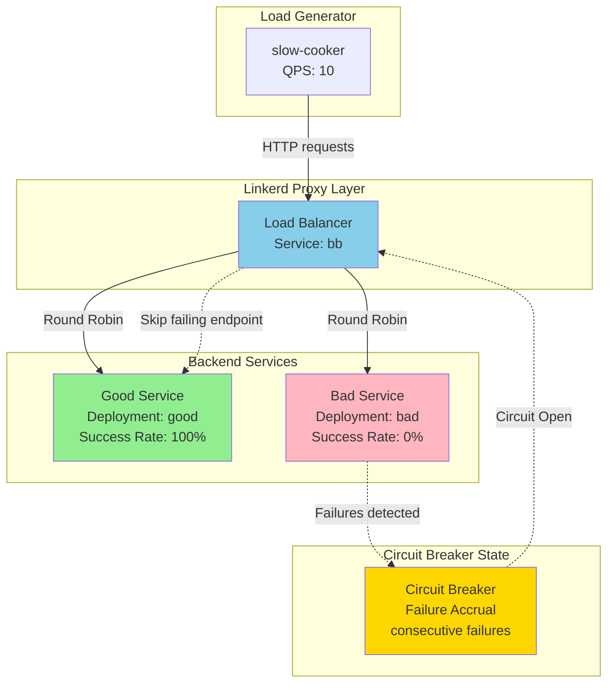

# Circuit Breaking Network Flow

## Architecture Diagram

## Flow Explanation

1. **Initial Traffic Distribution**: The slow-cooker generates 10 QPS of HTTP requests to the `bb` service
2. **Load Balancing**: Linkerd's load balancer distributes requests between the good and bad services using round-robin
3. **Failure Detection**: The bad service fails 100% of requests, which are detected by Linkerd's failure accrual mechanism
4. **Circuit Opening**: After 5 consecutive failures (default threshold), the circuit breaker opens for the bad service
5. **Traffic Isolation**: All subsequent requests are routed only to the good service, isolating the failing endpoint
6. **Recovery**: The circuit breaker will eventually close and retry the bad service to check if it has recovered

## Key Components

- **slow-cooker**: Load generator using `buoyantio/slow_cooker:1.3.0`
- **bb service**: Kubernetes service that load balances between good and bad deployments
- **good deployment**: Healthy service using `buoyantio/bb:v0.0.6`
- **bad deployment**: Unhealthy service with `--percent-failure=100` flag
- **Circuit Breaker**: Linkerd's failure accrual with `consecutive` strategy 